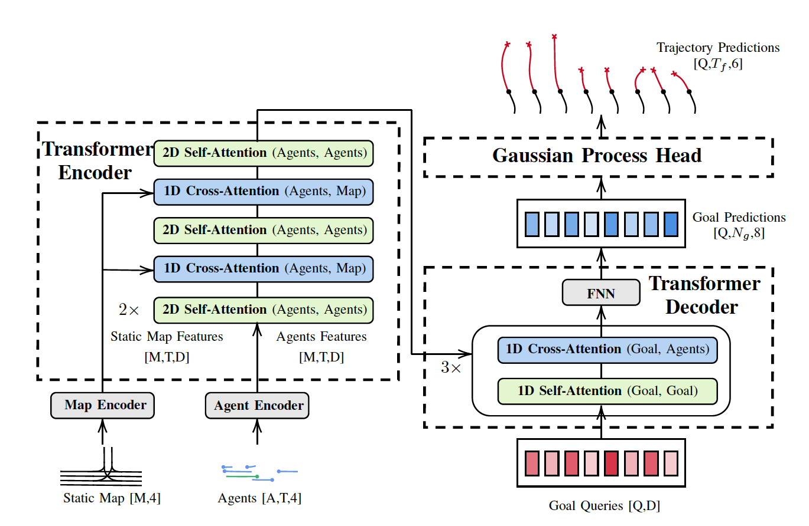

# Goal Transformer: Dynamics-Aware Motion Prediction using Multidimensional Transformers and Gaussian Processes

## Abstract
Predicting the motion of agents in automated driving settings is an integral part of the autonomous driving task. Road agents, such as vehicles, pedestrians, and cyclists, can move in unexpected ways, even when following the traffic rules, and their motion is often too complicated to be predicted with high accuracy due to the involved uncertainty in the decision-making of the humans involved. In this work, the goal is to predict possible trajectories of road agents over a fixed future time horizon given the observed trajectories of the target and nearby agents, along with their context, such as HD map information. Due to the inevitable uncertainty, a multi-modal approach is used to capture both the intent and position uncertainties. A number of approaches have been investigated for motion prediction, such as heuristic-based, convolutional neural network, graph-neural network, and transformer-based models. Here, we propose Goal Transformer: a multidimensional transformer neural network with a Gaussian process head that predicts multiple future trajectories with single-integrator dynamics enforced as a soft-constraint through the kernel of the Gaussian process. The trajectories generated by the Gaussian process head are controlled by intermediate goals -- i.e. the intent of the agent -- predicted by the transformer. The model is trained end-to-end and evaluated on the Argoverse Motion Forecasting dataset.


## Installation

This repo has been tested on:
- `python-3.7.0`

1. Prepare python environment:
```
python3 -m venv env
source env/bin/activate
```

2. Install `argoverse-api`:
```
git submodule update --init --recursive
wget https://s3.amazonaws.com/argoai-argoverse/hd_maps.tar.gz && tar -xzf hd_maps.tar.gz && mv map_files argoverse-api && rm hd_maps.tar.gz
pip install -e argoverse-api/
```

If there is an error installing the `argoverse-api` library, this command might help:
```
sudo apt-get install build-essential autoconf libtool pkg-config python-opengl python-pil python-pyrex python-pyside.qtopengl idle-python2.7 qt4-dev-tools qt4-designer libqtgui4 libqtcore4 libqt4-xml libqt4-test libqt4-script libqt4-network libqt4-dbus python-qt4 python-qt4-gl libgle3 python-dev libssl-dev
```

3. Install `requirements.txt` packages:
```
pip install -r requirements.txt
```

## Data Preparation

1. Download dataset
```
mkdir -p data/argoverse/forecasting/raw
cd data/argoverse/forecasting/raw
wget https://s3.amazonaws.com/argoai-argoverse/forecasting_train_v1.1.tar.gz && tar -xzvf forecasting_train_v1.1.tar.gz
wget https://s3.amazonaws.com/argoai-argoverse/forecasting_val_v1.1.tar.gz && tar -xzvf forecasting_val_v1.1.tar.gz
wget https://s3.amazonaws.com/argoai-argoverse/forecasting_test_v1.1.tar.gz && tar -xzvf forecasting_test_v1.1.tar.gz
cd ../../..
```

2. Parse the training, validation, and test data. Run in parallel to speed up parsing:
```
mpirun -n 16 python argoverse_parser.py --train
mpirun -n 16 python argoverse_parser.py --val
mpirun -n 16 python argoverse_parser.py --test
```

3. Extract clusters from the training data (the number of clusters is defined in the model config file):
```
python create_clusters.py --config config/goal_transformer.yaml
```

## Train and Validate:

Now choose your configuration file (e.g. config/goal_transformer_Q32D256Ng3.yaml) and start training. Logging is done with [Comet](www.comet.ml):
```
python main.py --config config/goal_transformer_Q32D256Ng3.yaml --train
```

## Model Architecture

<p float="left">
  
</p>


